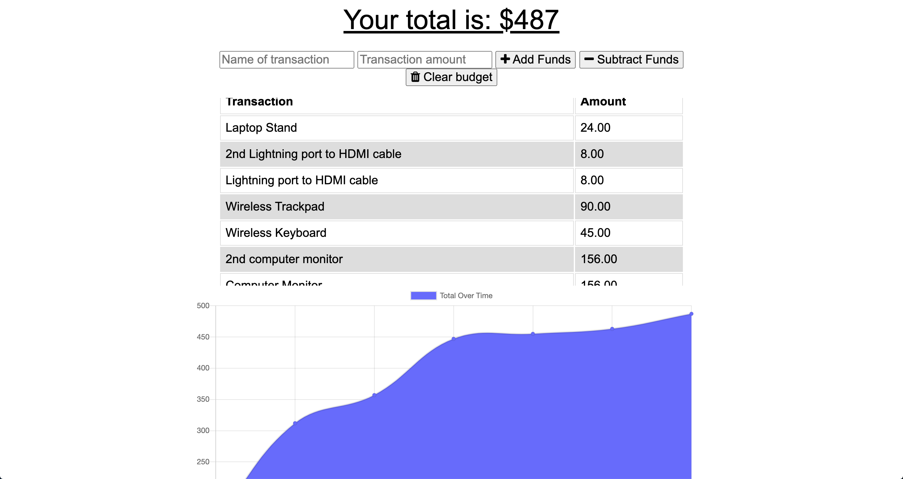

# Budget Trackers

# Link to Application

[VIEW MY APPLICATION HERE!](https://desolate-coast-60283.herokuapp.com/)

## Table of Contents

* [Description](#Description)
* [Author](#Author)

## Description

An application that gives users a fast and easy way to track their money is extremely important in today's society, but allowing them to access that information anytime is even more important, especially for those business travelers who fly many times a week with sometimes bad wifi on the aircraft. Having offline functionality is paramount to my application's success.

The user will be able to add expenses and deposits to their budget with or without a connection. When entering transactions offline, they are able to populate the total when brought back online.

## Author

**Christopher Hicks**

- Github: [chris31roc](https://github.com/chris31roc)

- Email: chris31roc@yahoo.com